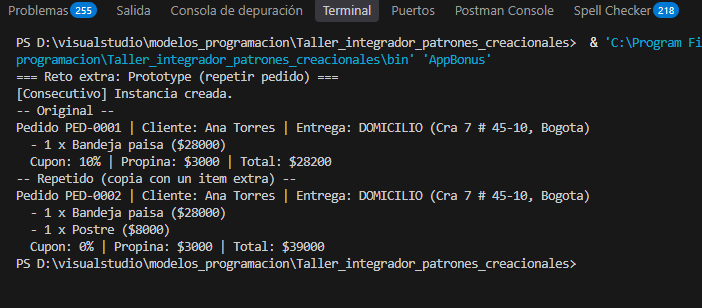
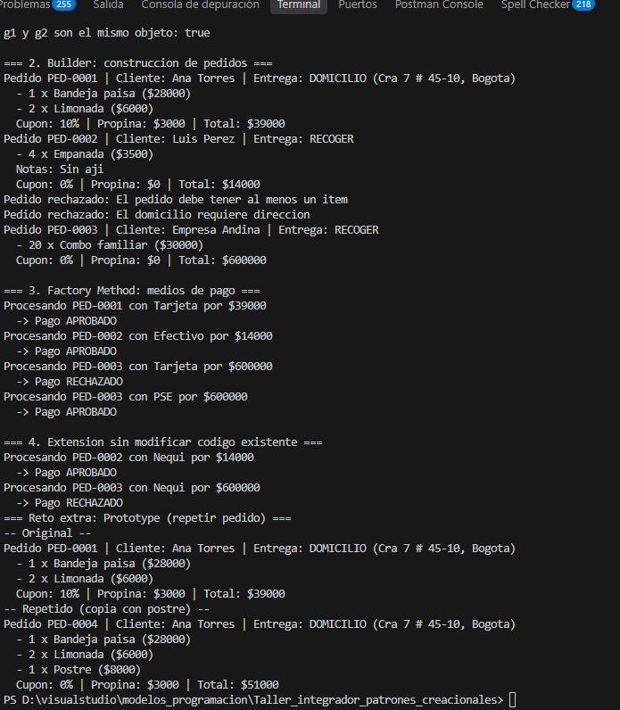

# DomiExpress — Taller de patrones creacionales

Mini sistema de pedidos a domicilio desarrollado en Java. Integra los patrones Singleton, Builder y Factory Method, incorpora Nequi como extensión y resuelve el reto adicional Prototype.

## Integrantes

| Integrante | Código |
|---|---|
| Jose Miguel Bueno Martinez | 20251020093 |
| Jhomar Armando Bojaca Landinez | 20211020130 |
| Tomás Torres Morales | 20251020167 |


## Enunciado

[Taller integrador: patrones creacionales](https://github.com/norbeydanilo/modelos-de-programacion/blob/main/guias-ejercicios/03.taller-creacionales.md)

## Objetivo

Construir un sistema de pedidos que permita:

- Generar un consecutivo único para cada pedido válido.
- Configurar pedidos con datos obligatorios y opcionales.
- Validar la información antes de crear el pedido.
- Calcular el total con descuento y propina.
- Procesar pagos mediante distintas pasarelas.
- Agregar medios de pago sin modificar la lógica existente.
- Repetir un pedido sin alterar el original.

## Problemas identificados
Antes de escribir la solución, se notaron los siguientes tres problemas concretos:

- Se está implementando un contador dentro de cada clase siendo que se puede referenciar a un mismo contador 
- Dentro del constructor se están especificando muchos atributos directamente y no se identifica cuales son obligatorios y cuales no.
- El crear un nuevo medio de pago nos obliga estár en constante modificación del codigo en lugar solo agregar el medio de pago directamente.

## Entregables

| Entregable | Ubicación |
|---|---|
| Código fuente del proyecto | [`src/`](src/) |
| Diagrama de clases con patrones identificados | [Sección **Diagrama de clases**](https://github.com/jhomarABL/Taller_integrador_patrones_creacionales#diagrama-de-clases) |
| Justificación escrita | [Sección **Justificación de los patrones**](https://github.com/jhomarABL/Taller_integrador_patrones_creacionales#justificaci%C3%B3n-de-los-patrones) |
| Captura de `App` con Nequi habilitado | [`docs/evidencias/salida-app.png`](docs/evidencias/salida-app.png) |
| Reto opcional Prototype | [`src/AppBonus.java`](src/AppBonus.java) |


## Estructura del proyecto

```text
Taller_integrador_patrones_creacionales/
├── .gitignore
├── README.md
├── src/
│   ├── App.java
│   ├── AppBonus.java
│   ├── GeneradorConsecutivo.java
│   ├── ItemPedido.java
│   ├── Pedido.java
│   ├── TipoEntrega.java
│   ├── PasarelaPago.java
│   ├── PasarelaTarjeta.java
│   ├── PasarelaPSE.java
│   ├── PasarelaEfectivo.java
│   ├── PasarelaNequi.java
│   ├── ProcesadorPago.java
│   ├── ProcesadorTarjeta.java
│   ├── ProcesadorPSE.java
│   ├── ProcesadorEfectivo.java
│   └── ProcesadorNequi.java
└── docs/
    └── evidencias/
        ├── salida-app.png
        └── salida-bonus.png
```


## Requisitos implementados

| Requisito | Solución |
|---|---|
| R1. Consecutivo único | `GeneradorConsecutivo` centraliza la numeración. |
| R2. Datos obligatorios y opcionales | `Pedido.Builder` proporciona una API fluida y valores predeterminados. |
| R3. Validación al construir | `construir()` verifica los datos antes de solicitar el consecutivo. |
| R4. Total del pedido | `calcularTotal()` aplica descuento y suma propina. |
| R5. Medios de pago | `ProcesadorPago` define el flujo común y utiliza una pasarela. |
| R6. Extensión con Nequi | Se agregan `ProcesadorNequi` y `PasarelaNequi`. |
| Reto Prototype | `clonar()` crea un pedido independiente con un nuevo consecutivo y sin cupón. |

### Datos del pedido

| Dato | Regla |
|---|---|
| Cliente | Obligatorio |
| Tipo de entrega | `RECOGER` por defecto |
| Dirección | Obligatoria para `DOMICILIO` |
| Ítems | Al menos uno |
| Notas | Vacías por defecto |
| Cupón | Entre 0 y 100; 0 por defecto |
| Propina | 0 por defecto |

### Orden de validación

En `Pedido.Builder.construir()` se comprueba:

1. Cliente.
2. Existencia de al menos un ítem.
3. Dirección para entregas a domicilio.
4. Rango del cupón.

Los mensajes de error son:

```text
El cliente es obligatorio
El pedido debe tener al menos un item
El domicilio requiere direccion
El cupon debe estar entre 0 y 100
```

Las tres primeras validaciones lanzan `IllegalStateException`. La validación del cupón lanza `IllegalArgumentException`.

El consecutivo se solicita después de validar, por lo que un pedido rechazado no consume un número.

### Cálculo del total

```text
subtotal = suma de precioUnitario * cantidad

total = subtotal * (100 - cupon) / 100.0 + propina
```

Ejemplo del pedido de Ana Torres:

```text
Subtotal: 28000 + (6000 * 2) = 40000
Descuento: 10%
Propina: 3000

Total: 40000 * 90 / 100 + 3000 = 39000
```

### Reglas de aprobación

| Medio | Regla |
|---|---|
| Tarjeta | Aprueba si el total es menor o igual a 500000 |
| PSE | Aprueba siempre |
| Efectivo | Aprueba siempre |
| Nequi | Aprueba si el total es menor o igual a 300000 |

## Diagrama de clases

El diagrama representa la solución con Singleton mediante una clase contenedora interna, Builder como clase interna de `Pedido` y Factory Method para crear las pasarelas.

```mermaid
classDiagram
    direction TB

    class App {
        <<Aplicacion principal>>
        +main(String[] args) void
    }

    class AppBonus {
        <<Prueba Prototype>>
        +main(String[] args) void
    }

    class TipoEntrega {
        <<enumeration>>
        RECOGER
        DOMICILIO
    }

    class ItemPedido {
        -String nombre
        -double precioUnitario
        -int cantidad
        +ItemPedido(String nombre, double precioUnitario, int cantidad)
        +getNombre() String
        +getPrecioUnitario() double
        +getCantidad() int
        +getSubtotal() double
    }

    class GeneradorConsecutivo {
        <<Singleton>>
        -int contador
        -GeneradorConsecutivo()
        +obtenerInstancia() GeneradorConsecutivo
        +siguiente() String
    }

    class ContenedorInstancia {
        <<Clase interna estatica>>
        -GeneradorConsecutivo INSTANCIA
    }

    class Pedido {
        <<Producto Builder y Prototype>>
        -String id
        -String cliente
        -TipoEntrega tipoEntrega
        -String direccion
        -List~ItemPedido~ items
        -String notas
        -int cupon
        -double propina
        -Pedido(Builder builder, String id)
        +getId() String
        +getCliente() String
        +getTipoEntrega() TipoEntrega
        +getDireccion() String
        +getItems() List~ItemPedido~
        +getNotas() String
        +getCupon() int
        +getPropina() double
        +calcularSubtotal() double
        +calcularTotal() double
        +mostrarResumen() void
        +clonar() Pedido
        +agregarItem(ItemPedido item) void
        -formatearMonto(double monto) String
    }

     class PrototipoPedido {
        <<interface>>
        +clonar() Pedido
    }

    class Builder {
        <<Builder interno estatico>>
        -String cliente
        -TipoEntrega tipoEntrega
        -String direccion
        -List~ItemPedido~ items
        -String notas
        -int cupon
        -double propina
        +Builder()
        +conCliente(String cliente) Builder
        +conTipoEntrega(TipoEntrega tipoEntrega) Builder
        +conDireccion(String direccion) Builder
        +agregarItem(ItemPedido item) Builder
        +conNotas(String notas) Builder
        +conCupon(int cupon) Builder
        +conPropina(double propina) Builder
        +construir() Pedido
    }

    class PasarelaPago {
        <<interface>>
        +nombre() String
        +cobrar(double monto) boolean
    }

    class PasarelaTarjeta {
        <<Producto concreto>>
        -double LIMITE
        +nombre() String
        +cobrar(double monto) boolean
    }

    class PasarelaPSE {
        <<Producto concreto>>
        +nombre() String
        +cobrar(double monto) boolean
    }

    class PasarelaEfectivo {
        <<Producto concreto>>
        +nombre() String
        +cobrar(double monto) boolean
    }

    class PasarelaNequi {
        <<Producto concreto>>
        -double LIMITE
        +nombre() String
        +cobrar(double monto) boolean
    }

    class ProcesadorPago {
        <<Creador abstracto>>
        +procesar(Pedido pedido) void
        #crearPasarela() PasarelaPago
    }

    class ProcesadorTarjeta {
        <<Creador concreto>>
        +ProcesadorTarjeta()
        #crearPasarela() PasarelaPago
    }

    class ProcesadorPSE {
        <<Creador concreto>>
        +ProcesadorPSE()
        #crearPasarela() PasarelaPago
    }

    class ProcesadorEfectivo {
        <<Creador concreto>>
        +ProcesadorEfectivo()
        #crearPasarela() PasarelaPago
    }

    class ProcesadorNequi {
        <<Creador concreto>>
        +ProcesadorNequi()
        #crearPasarela() PasarelaPago
    }

    App ..> GeneradorConsecutivo : comprueba Singleton
    App ..> Builder : construye pedidos
    App ..> ItemPedido : crea items
    App ..> ProcesadorTarjeta : instancia
    App ..> ProcesadorPSE : instancia
    App ..> ProcesadorEfectivo : instancia
    App ..> ProcesadorNequi : instancia

    AppBonus ..> Builder : construye original
    AppBonus ..> ItemPedido : crea items
    AppBonus ..> PrototipoPedido : utiliza
    AppBonus ..> Pedido : recibe clon

    GeneradorConsecutivo ..> ContenedorInstancia : clase interna
    ContenedorInstancia --> GeneradorConsecutivo : mantiene instancia unica

    Pedido ..> Builder : clase interna
    Builder ..> Pedido : construye
    Builder ..> GeneradorConsecutivo : solicita consecutivo
    Builder --> TipoEntrega : configura
    Builder o-- ItemPedido : acumula items

    Pedido --> TipoEntrega : utiliza
    Pedido *-- ItemPedido : contiene
    PrototipoPedido <|.. Pedido : implementa

    ProcesadorPago ..> Pedido : procesa
    ProcesadorPago ..> PasarelaPago : crea y utiliza

    ProcesadorPago <|-- ProcesadorTarjeta
    ProcesadorPago <|-- ProcesadorPSE
    ProcesadorPago <|-- ProcesadorEfectivo
    ProcesadorPago <|-- ProcesadorNequi

    PasarelaPago <|.. PasarelaTarjeta
    PasarelaPago <|.. PasarelaPSE
    PasarelaPago <|.. PasarelaEfectivo
    PasarelaPago <|.. PasarelaNequi

    ProcesadorTarjeta ..> PasarelaTarjeta : crea
    ProcesadorPSE ..> PasarelaPSE : crea
    ProcesadorEfectivo ..> PasarelaEfectivo : crea
    ProcesadorNequi ..> PasarelaNequi : crea

```



## Justificación de los patrones

**Singleton.** El fragmento inicial utiliza contadores que podrían repetirse en distintas clases y generar números inconsistentes. `GeneradorConsecutivo` concentra esa responsabilidad en una única instancia, con constructor privado y acceso estático. La clase contenedora interna permite inicializar la instancia de forma segura, y `siguiente()` está sincronizado para proteger el contador. No lo usaríamos como única solución de numeración en una aplicación distribuida, porque varias JVM tendrían contadores independientes; en ese caso sería necesario un mecanismo compartido, como una secuencia en una base de datos.

**Builder.** El constructor inicial con numerosos parámetros dificulta distinguir los datos obligatorios de los opcionales y favorece errores de orden. `Pedido.Builder` configura el pedido mediante métodos descriptivos, ofrece valores predeterminados y valida antes de construir. También permite agregar nuevos datos opcionales sin ampliar un constructor extenso. No lo usaríamos para una clase sencilla con pocos atributos y sin reglas de construcción complejas.

**Factory Method.** El bloque inicial de `if` y `else if` obliga a modificar código existente cada vez que aparece un medio de pago. `ProcesadorPago` conserva el flujo común en `procesar()` y delega la creación de la pasarela mediante `crearPasarela()`. Los creadores concretos permiten incorporar Nequi agregando nuevas clases, sin modificar el flujo de cobro. No lo usaríamos si solo existiera un medio de pago fijo y no hubiera una necesidad razonable de variantes.

**Prototype — reto opcional.** `clonar()` permite repetir un pedido sin configurar manualmente todos sus datos. El clon obtiene otro consecutivo, conserva los datos del original y deja el cupón en cero. Su lista de ítems es independiente, por lo que agregar un producto al clon no modifica el original. No lo usaríamos si repetir el objeto fuera trivial o si reconstruirlo desde sus datos resultara más claro.

## Extensión con Nequi

Para incorporar el nuevo medio de pago se agregan dos clases:

```text
ProcesadorNequi.java
PasarelaNequi.java
```

`ProcesadorNequi` implementa el método de fábrica:

```java
@Override
protected PasarelaPago crearPasarela() {
    return new PasarelaNequi();
}
```

`PasarelaNequi` implementa la aprobación hasta 300000.

No es necesario modificar `ProcesadorPago` ni las pasarelas y procesadores existentes. En `App` se habilita únicamente el bloque de demostración previsto por el taller.

## Evidencia de ejecución

### Programa principal




### Resultados esperados

| Caso | Resultado |
|---|---|
| Comparación de las instancias del Singleton | `true` |
| Pedido de Ana Torres | `PED-0001`, total 39000 |
| Pedido de Luis Pérez | `PED-0002`, total 14000 |
| Pedido sin ítems | Rechazado |
| Pedido a domicilio sin dirección | Rechazado |
| Pedido de Empresa Andina | `PED-0003`, total 600000 |
| Tarjeta para Ana Torres | Aprobado |
| Efectivo para Luis Pérez | Aprobado |
| Tarjeta para Empresa Andina | Rechazado |
| PSE para Empresa Andina | Aprobado |
| Nequi para Luis Pérez | Aprobado |
| Nequi para Empresa Andina | Rechazado |

El pedido de Empresa Andina debe conservar el identificador `PED-0003`, aunque antes existan dos intentos rechazados.

## Reto adicional Prototype

El programa `AppBonus` crea un pedido original, lo clona y agrega un postre únicamente al clon.

### Comportamiento esperado

| Característica | Original | Clon |
|---|---|---|
| Identificador | `PED-0001` | `PED-0002` |
| Cupón | 10% | 0% |
| Ítems | Bandeja paisa | Bandeja paisa y postre |
| Propina | 3000 | 3000 |
| Total | 28200 | 39000 |

El original no debe contener el postre agregado al clon.

### Evidencia 



